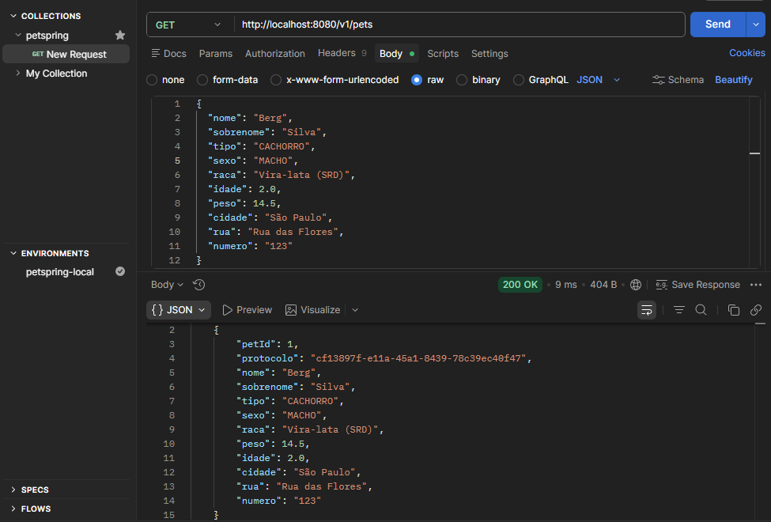

<div align="center">

<h1>PetSpring</h1>
<p>API REST para gerenciamento de abrigo de animais — cadastro de pets, donos e fluxo completo de adoção.</p>


</div>

---

## Sobre o projeto

O PetSpring é uma API RESTful construída para simular o sistema de um abrigo de animais. A API permite o cadastro de pets e adotantes, o gerenciamento do fluxo de adoção e buscas com filtros dinâmicos.

O projeto foi desenvolvido como portfólio pessoal com foco em boas práticas de desenvolvimento back-end: separação de responsabilidades, DTOs por operação, tratamento de erros centralizado, paginação e testes unitários com Mockito.

---

##  Índice

- [Arquitetura](#arquitetura)
- [Funcionalidades](#funcionalidades)
- [Endpoints](#endpoints)
- [Tecnologias](#tecnologias)
- [Como rodar localmente](#como-rodar-localmente)
- [Variáveis de ambiente](#variáveis-de-ambiente)
- [Rodando os testes](#rodando-os-testes)
- [Decisões de design](#decisões-de-design)

---

## Arquitetura

O projeto segue o padrão em camadas clássico do ecossistema Spring, com separação clara entre as responsabilidades de cada camada.

```
┌─────────────────────────────────────────────────────┐
│                    HTTP Request                      │
└────────────────────┬────────────────────────────────┘
                     │
          ┌──────────▼──────────┐
          │     Controller      │  recebe e valida a requisição (@Valid)
          │  PetController      │  converte para DTO de entrada
          │  DonoController     │
          └──────────┬──────────┘
                     │
          ┌──────────▼──────────┐
          │      Service        │  regras de negócio
          │  PetService         │  lança exceções customizadas
          │  DonoService        │  orquestra as operações
          └──────────┬──────────┘
                     │
          ┌──────────▼──────────┐
          │    Repository       │  acesso ao banco via Spring Data JPA
          │  IPetRepository     │  queries JPQL com filtros dinâmicos
          │  IDonoRepository    │
          └──────────┬──────────┘
                     │
          ┌──────────▼──────────┐
          │       MySQL         │
          │   tb_pets           │
          │   tb_donos          │
          └─────────────────────┘

Transversal a todas as camadas:
  GlobalHandlerException (@RestControllerAdvice) → formata todos os erros
```

### Modelo de dados

```
tb_donos                         tb_pets
─────────────────────            ──────────────────────────
donoId   INT PK AUTO             petId      INT PK AUTO
nome     VARCHAR NOT NULL        nome       VARCHAR NOT NULL
cpf      VARCHAR UNIQUE NN       sobrenome  VARCHAR NOT NULL
telefone VARCHAR NOT NULL        protocolo  VARCHAR UNIQUE NN
cidade   VARCHAR                 tipo       ENUM(CACHORRO,GATO)
rua      VARCHAR                 sexo       ENUM(MACHO,FEMEA)
numero   VARCHAR                 raca       VARCHAR
                                 peso       DOUBLE NOT NULL
                                 idade      DOUBLE NOT NULL
                                 cidade     VARCHAR
                                 rua        VARCHAR
                                 numero     VARCHAR
                                 dono_id    INT FK → tb_donos
```

Relacionamento: `tb_donos` **1 : N** `tb_pets` — um dono pode ter vários pets, um pet pertence a no máximo um dono.

---

## Funcionalidades

- **Pets:** cadastro, listagem paginada, busca por ID, atualização, remoção e busca com filtros opcionais por tipo, raça e cidade
- **Donos:** cadastro com CPF único, listagem paginada, busca por ID, atualização (CPF imutável após cadastro), remoção com desvinculação segura dos pets
- **Adoção:** associação de um pet a um dono, com validação de disponibilidade
- **Validação de entrada:** Bean Validation em todos os DTOs com mensagens de erro claras
- **Tratamento de erros:** resposta padronizada (`message`, `status`, `timestamp`, `path`) para todos os erros da API
- **Paginação:** suporte nativo via `Pageable` com parâmetros `page`, `size` e `sort`

---



## Endpoints

### Pets — `/v1/pets`

| Método | Rota | Descrição | Status de sucesso |
|--------|------|-----------|-------------------|
| `POST` | `/v1/pets` | Cadastra um novo pet | `201 Created` |
| `GET` | `/v1/pets` | Lista todos os pets (paginado) | `200 OK` |
| `GET` | `/v1/pets/{petId}` | Busca um pet por ID | `200 OK` |
| `PUT` | `/v1/pets/{petId}` | Atualiza os dados de um pet | `200 OK` |
| `DELETE` | `/v1/pets/{petId}` | Remove um pet | `204 No Content` |
| `PUT` | `/v1/pets/{petId}/adocao/{donoId}` | Registra a adoção de um pet | `204 No Content` |
| `GET` | `/v1/pets/pesquisa` | Busca com filtros opcionais (paginado) | `200 OK` |

#### Filtros disponíveis em `GET /v1/pets/pesquisa`

```
?tipo=CACHORRO        valores: CACHORRO, GATO
?raca=Labrador
?cidade=São Paulo
?page=0&size=20&sort=nome
```

### Donos — `/v1/donos`

| Método | Rota | Descrição | Status de sucesso |
|--------|------|-----------|-------------------|
| `POST` | `/v1/donos` | Cadastra um novo dono | `201 Created` |
| `GET` | `/v1/donos` | Lista todos os donos (paginado) | `200 OK` |
| `GET` | `/v1/donos/{donoId}` | Busca um dono por ID | `200 OK` |
| `PUT` | `/v1/donos/{donoId}` | Atualiza os dados editáveis do dono | `200 OK` |
| `DELETE` | `/v1/donos/{donoId}` | Remove um dono | `204 No Content` |
| `GET` | `/v1/donos/{donoId}/pets` | Lista os pets de um dono | `200 OK` |

#### Exemplo de payload — `POST /v1/pets`

```json
{
  "nome": "Rex",
  "sobrenome": "Silva",
  "tipo": "CACHORRO",
  "sexo": "MACHO",
  "peso": 18.5,
  "idade": 3.0,
  "raca": "Labrador",
  "cidade": "São Paulo",
  "rua": "Rua das Flores",
  "numero": "42"
}
```

#### Exemplo de resposta — `GET /v1/pets`

```json
{
  "content": [
    {
      "petId": 1,
      "protocolo": "a3f7b2c1-...",
      "nome": "Rex",
      "sobrenome": "Silva",
      "tipo": "CACHORRO",
      "sexo": "MACHO",
      "raca": "Labrador",
      "peso": 18.5,
      "idade": 3.0,
      "cidade": "São Paulo",
      "dono": null
    }
  ],
  "totalElements": 1,
  "totalPages": 1,
  "size": 20,
  "number": 0
}
```

#### Formato de erro padronizado

```json
{
  "message": "Pet não encontrado",
  "status": 404,
  "timestamp": "2025-07-09T14:32:00Z",
  "path": "/v1/pets/999"
}
```

---

## Tecnologias

| Tecnologia | Versão | Uso |
|------------|--------|-----|
| Java | 21 | Linguagem principal |
| Spring Boot | 4.0.6 | Framework web e auto-configuração |
| Spring Data JPA | — | Persistência com Hibernate |
| Spring Validation | — | Bean Validation nos DTOs |
| MySQL | 8.x | Banco de dados relacional |
| Lombok | — | Redução de boilerplate |
| JUnit 5 | — | Framework de testes unitários |
| Mockito | — | Mock de dependências nos testes |
| AssertJ | — | Asserções fluentes nos testes |
| Maven | 3.9 | Gerenciador de build e dependências |

---

## Como rodar localmente

### Pré-requisitos

- Java JDK 21+
- Maven 3.9+
- MySQL 8.x rodando localmente

### Passo a passo

**1. Clone o repositório**

```bash
git clone [https://github.com/Lucas021-pro/Sistema_de_Cadastro_Pets_Spring.git](https://github.com/Lucas021-pro/Sistema_de_Cadastro_Pets_Spring.git)
cd Sistema_de_Cadastro_Pets_Spring
```

**2. Configure o banco de dados**

Crie o banco de dados (ou deixe o Hibernate criar automaticamente via `ddl-auto: update`):

```sql
CREATE DATABASE abrigo;
```

**3. Configure as variáveis de ambiente**

Você pode exportar as variáveis no terminal ou criar um arquivo `.env` (ver seção abaixo):

```bash
export DATABASE_USERNAME=root
export DATABASE_PASSWORD=sua_senha
```

**4. Suba a aplicação**

```bash
./mvnw spring-boot:run
```

A API estará disponível em `http://localhost:8081`.

**5. Teste com um GET simples**

```bash
curl http://localhost:8081/v1/pets
```

Resposta esperada:

```json
{ "content": [], "totalElements": 0, "totalPages": 0, "size": 20, "number": 0 }
```

---

## Variáveis de ambiente

| Variável | Valor padrão | Descrição |
|----------|-------------|-----------|
| `DATABASE_USERNAME` | `root` | Usuário do MySQL |
| `DATABASE_PASSWORD` | `root` | Senha do MySQL |

O `application.yaml` usa a sintaxe `${VARIAVEL:valor_padrao}` — se a variável de ambiente não estiver definida, o valor padrão é usado. Isso significa que o projeto roda com `root`/`root` sem nenhuma configuração extra em ambiente de desenvolvimento.

Para usar um usuário e senha diferentes, basta exportar as variáveis antes de subir a aplicação:

```bash
export DATABASE_USERNAME=petspring_user
export DATABASE_PASSWORD=senha_segura
./mvnw spring-boot:run
```

### Perfis de ambiente

| Perfil | Arquivo | Quando usar |
|--------|---------|-------------|
| `dev` | `application-dev.yaml` | Desenvolvimento local — ativa `show-sql: true` para ver as queries geradas pelo Hibernate |
| (padrão) | `application.yaml` | Produção — `show-sql: false` |

O perfil `dev` já está ativo por padrão (`spring.profiles.active: dev`). Para desativar o log SQL, remova essa linha ou altere para outro perfil.

---

## Rodando os testes

```bash
./mvnw test
```

Os testes são **unitários puros** — os repositories são mockados com Mockito, então nenhum banco de dados é necessário para executá-los. Eles rodam em menos de 5 segundos.

### O que é testado

**`PetServiceTest`**
- `criarPet` — deve salvar com protocolo gerado e tratar campos opcionais
- `buscarPetPorId` — deve retornar o DTO correto e lançar `NotFoundException` para ID inexistente
- `deletarPet` — deve deletar quando existe e lançar `NotFoundException` quando não existe
- `adotarPet` — deve associar dono quando disponível, lançar `BadRequestException` se já adotado e `NotFoundException` se dono inexistente
- `listarPetsPorDono` — deve retornar lista do dono e lançar `NotFoundException` para dono inexistente
- `pesquisarPets` — deve repassar filtros e paginação para o repository

**`DonoServiceTest`**
- `cadastrarDono` — deve cadastrar quando CPF é novo e lançar `BadRequestException` para CPF duplicado
- `deletarDono` — deve desvincular pets antes de excluir o dono e lançar `NotFoundException` para dono inexistente
- `buscarDonosPorId` — deve retornar o DTO correto e lançar `NotFoundException`
- `atualizarDono` — deve atualizar campos editáveis sem alterar o CPF e lançar `NotFoundException`
- `listAllDonos` — deve retornar a página convertida para DTO

---

## Decisões de design

**DTOs separados por operação**
O `DonoUpdateDTO` não contém o campo `cpf`. Essa é uma decisão consciente: o CPF é a chave natural do Dono e não deve ser alterável após o cadastro. Manter o campo fora do DTO de update impede que a API aceite uma alteração que seria silenciosamente ignorada — o contrato da API reflete a regra de negócio.

**Deleção segura de donos**
Ao excluir um dono, o `DonoService` percorre todos os seus pets e define `dono = null` antes de deletar o registro. Os pets não são removidos — eles retornam ao abrigo e ficam disponíveis para nova adoção. Essa é uma regra de domínio explícita, não um comportamento de cascata do JPA.

**Cache de camadas no Dockerfile**
O `COPY pom.xml` é feito antes do `COPY src/` para aproveitar o cache de layers do Docker. As dependências (~200 jars) só são baixadas novamente se o `pom.xml` mudar — se apenas o código Java for alterado, o rebuild leva segundos.

**`ddl-auto: update`**
Adequado para desenvolvimento local. Em um ambiente de produção real, o recomendado seria usar migrations versionadas com Flyway ou Liquibase.

---

<div align="center">
  <p>Desenvolvido por <strong>Lucas</strong> — estudante de Sistemas de Informação no IFSP</p>
</div>